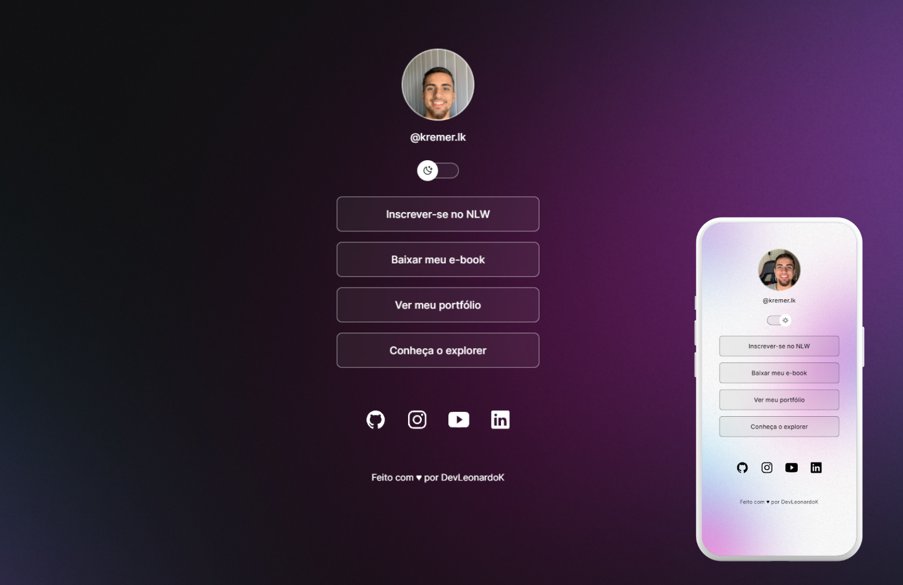

<h1 align="center"> My Profile </h1>

 Web Page construída com o propósito de conhecer sobre o usuário e apresentar redes sociais  

  <a href="#-tecnologias">Tecnologias</a>&nbsp;&nbsp;&nbsp;|&nbsp;&nbsp;&nbsp;
  <a href="#-projeto">Projeto</a>&nbsp;&nbsp;&nbsp;

 

  

## 🚀 Tecnologias

Esse projeto foi desenvolvido com as seguintes tecnologias:

- HTML, CSS e SASS
- JavaScript
- Git e Github
- Figma

## 💻 Projeto

O MyProfile é um coletor de links para ser utilizado como um cartão de visita digital.

- [Acesse o projeto finalizado, online](https://devleonardok.github.io/MyProfile/)

---

Feito by DevLeonardoK

